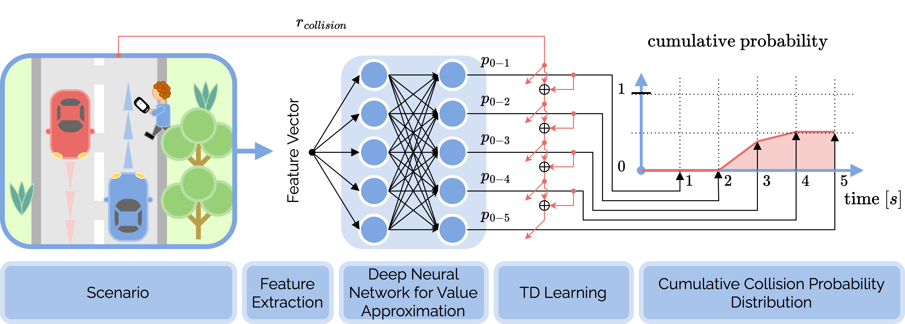
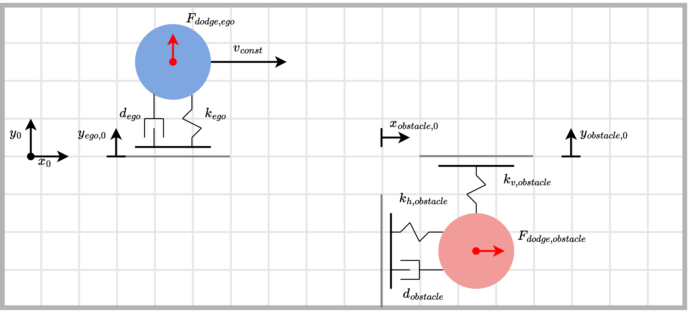

# CollisionPro


```A framework for collision probability distribution estimation via temporal difference learning.```



---

<p align="center">
    
</p>

---

In today's deep learning era, understanding the inner workings of complex models is of major interest. Enter CollisionPro, a noval framework designed to estimate cumulative collision probability distributions through temporal difference learning.

But what sets CollisionPro apart? It's all about transparency and explainability. In an age where black-box algorithms reign supreme, CollisionPro takes a step towards explainable AI. By generating a cumulative probability distribution, it offers not just a single risk assessment value, but a spectrum of interpretable values. Moreover, each value could be interpreted in the context of reinforcement learning. 

---

## Quick Links

+ [Installation](#installation)
+ [Run Examples](#run-examples)
+ [HowTo Guide](#howto-guide)

## Installation

To effortlessly install CollisionPro, utilize the following pip command:

```bash
pip3 install git+https://github.com/UniBwTAS/CollisionPro.git#egg=CollisionPro
```

or

```bash
python3 -m pip install git+https://github.com/UniBwTAS/CollisionPro.git#egg=CollisionPro
```

After a successful installation, ensure the correctness of the setup by following these steps:

1. Open a new terminal window
2. Launch the Python 3 shell:

```bash
python3
```

3. Verify the installation by importing the CollisionPro module:

```python
import collisionpro
```

## Run Examples

We provide some examples for an easier/faster understanding of CollisionPro. 
Each example consists of an environment (*env.py*), an approximator (*approximator.py*), that learns the probability distribution, a controller (*controller.py*) if required, that provides an action given the current state, and a main script (*main.py*) that is setting up the training pipeline.
For more information see [HowTo Guide](./docs/HowTo.md).

Once you have installed CollisionPro (see [Installation](#installation)), you can easily run our examples:

**Random Walk (Easy Example)**


The Random Walk environment consists of sequential states, where the first and last states indicate terminal states. 
The agent transitions with a 0.5 probability to the right and a 0.5 probability to the left. 
For each non-terminal state, the agent receives a reward of r=0, while for terminal states, the agent receives a reward of r=-1, which corresponds to a *collision*.

+ No action space → no controller
+ No value function approximation

```python
from collisionpro.examples.random_walk.main import run
run()
```

**Moving Circles (Advanced Example)**




The Moving Circles environment is centered around the ego circle (blue), which moves along the x-axis with a constant linear velocity. 
Obstacles (red circles) oscillate along the y-axis and can be modeled as mass-spring systems (no energy dissipation). 
When the outer circles of the ego and any obstacle overlap, a collision event is triggered, terminating the episode and resulting in a reward of -1.

Both the ego and obstacles predict each other's movements using constant kinematics into the future and adjust their positions accordingly. 
The ego ball can move along the y-axis and is modeled in y-direction as a mass-spring-damper system, while the obstacles can move along the x-axis.

+ Action space available → controller provided
+ Value function approximation via TensorFlow
+ Multi-agent, partially observable, continuous environment

Execute the following, which will iteratively generate samples, learn the collision probability distribution and finally generates collision characteristics that are plotted.

```python
from collisionpro.examples.moving_circles.main import run
run()
```

## HowTo Guide

Find a comprehensive Guide for CollisionPro functionalities and examples [here](./docs/HowTo.md).

## 