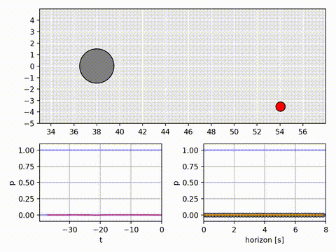

# CollisionPro


```A framework for collision probability distribution estimation via temporal difference learning.```


<p align="center">
    
</p>

---

In today's deep learning era, understanding the inner workings of complex models is of major interest. Enter CollisionPro, a noval framework designed to estimate cumulative collision probability distributions through temporal difference learning.

But what sets CollisionPro apart? It's all about transparency and explainability. In an age where black-box algorithms reign supreme, CollisionPro takes a step towards explainable AI. By generating a cumulative probability distribution, it offers not just a single risk assessment value, but a spectrum of interpretable values. Moreover, each value could be interpreted in the context of reinforcement learning. 

---

## Quick Links

+ [Installation](#installation)
+ [Run Examples](#run-examples)
+ [HowTo Guide](#howto-guide)

## Installation

To effortlessly install CollisionPro, utilize the following pip command:

```bash
pip3 install git+https://github.com/UniBwTAS/CollisionPro.git#egg=CollisionPro
```

or

```bash
python3 -m pip install git+https://github.com/UniBwTAS/CollisionPro.git#egg=CollisionPro
```

After a successful installation, ensure the correctness of the setup by following these steps:

1. Open a new terminal window
2. Launch the Python 3 shell:

```bash
python
```

3. Verify the installation by importing the CollisionPro module:

```python
import collisionpro
```

## Run Examples

We provide some examples for an easier/faster understanding of CollisionPro. Each example consists of an environment (*env.py*), an approximator (*approximator.py*), that learns the probability distribution and a main script (*main.py*) that setting up the training pipeline.
For more information see [HowTo Guide](./docs/HowTo.md).

Once you have installed CollisionPro (see [Installation](#installation)), you can easily run our examples:

**Random Walk (Easy Example)**

+ No action space
+ No value function approximation

```python
from collisionpro.examples.random_walk.main import run
run()
```

**Moving Circles (Advanced Example)**

TODO

## HowTo Guide

Find a comprehensive Guide for CollisionPro functionalities and examples [here](./docs/HowTo.md).

## 