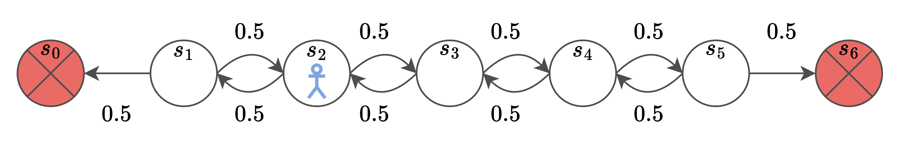
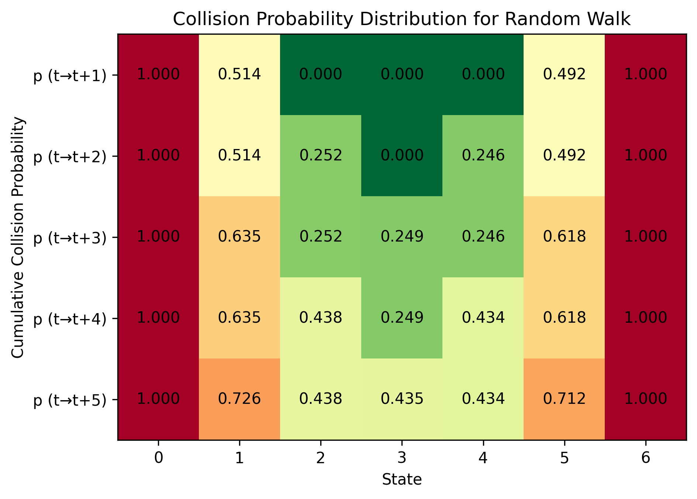

# How to Use the CollisionPro Library

This guide provides a comprehensive overview of the core functionalities of CollisionPro.

## Content

- [Simple Example](#simple-example) (...because everyone learns best by example)
- [Advanced Example](#advanced-example) (Integration of Neural Networks as approximator)
- [Sample Generation](#sample-generation) 
- [Target Generation](#target-generation)
- [Evaluation](#evaluation)
- [Tips](#tips)

## Simple Example

In this example we consider the simple Random Walk environment.
The Random Walk environment specifies a sequence of states, where with 0.5 probability the agent goes to the left state and with 0.5 probability to the right.
Once the agent reaches the boundary, the episode ends—this is equivalent to a collision and is rewarded with r=-1, otherwise r=0.
The figure below shows an environment with 7 states, where s_0 and s_6 are the terminal states, that correspond to a collision.



First we import and create the environment, which is also provided in our implementation. 
The implementation of environments is inspired by the [Gymnasium](https://gymnasium.farama.org) interface.

```python
from collisionpro.examples.random_walk.env import RandomWalk

n_states = 7
env = RandomWalk(n_states=n_states)
```

Next we need an approximator for saving the probability distribution over all states for each learning stage. 
As this example has a fairly simple complexity, we use a table for this task. 
We implemented the approximator already and want to import it

```python
from collisionpro.examples.random_walk.approximator import Approximator
```

Have a look at the approximator [here](../collisionpro/examples/random_walk/approximator.py). It is basically a table with a dimension of (#states, #lookahead steps), which provides a *fit*-function that incrementally updates the probability distribution for each state, given a list of inputs (states) and targets (bootstrapped values generated by the CollisionPro functionalities). Furthermore, the environment provides an *inference*-method, where given the states the probability distribution is extracted.

Let's create an approximator next

```python
n_h = 5
approximator = Approximator(n_h=n_h)
```

`n_h` is the number of lookahead steps (horizon) that we consider for our probability distribution.

To generate the data from the environment, we make use of the sampling functionalities provided by the CollisionPro class.

```python
from collisionpro.core.collisionpro import CollisionPro

p_c = 1.0
p_nc = 1.0
lambda_val = 0.25
td_max = n_h

collision_pro = CollisionPro(env=env,
                             n_h=n_h,
                             p_c=p_c,
                             p_nc=p_nc,
                             lambda_val=lambda_val,
                             td_max=td_max)
```

The arguments `p_c` and `p_nc` specify the probabilities of selecting collision and non-collision samples, respectively.
In this case both are set to 1 as collisions are very frequent.
The `lambda_val` corresponds to the TD(lambda) approach.
`td_max` specifies the truncation of TD(lambda) return.
We did not specify the controller, as this environment does not provide an action space.


Samples can be generated as follows:

```python
n_samp_total = 10000
samples = collision_pro.generate_samples(n=n_samp_total)
```

Finally, we can use the samples to generate the targets via the CollisionPro approach

```python
inputs, targets = collision_pro.generate_training_data(samples, approximator.inference)
```

The `generate_training_data` expects an inference function that is used to evaluate the samples.

Let's put everything together for a working learning pipeline:


```python
n_learning_steps = 10

for i in range(n_learning_steps):
    samples = collision_pro.generate_samples(n_samp_total)
    inputs, targets = collision_pro.generate_training_data(samples, approximator.inference)
    approximator.fit(inputs, targets)
```

The figure below shows the outcome of our training. 
Obviously at state 0 and 6 we have a collision probability of 1 as we are in a collision state.
In the first row (collision probability within one time step), it becomes evident that for states that are further away than 1 step of the terminal states, the collision probability is 0 as they are unreachable.
Also notice the pattern of the result.
As collision probability for a state changes only every second prediction step, it is an excellent exercise to see for yourself why this makes absolutely sense.




The code explained within that tutorial can be found [here](../collisionpro/examples/random_walk/main.py). 


## Advanced Example

In this example we will consider the [Moving Circles](../collisionpro/examples/moving_circles/env.py) environment.
This environment 

## Sample Generation

TODO

## Target Generation

TODO

## Evaluation

TODO

## Tips

TODO